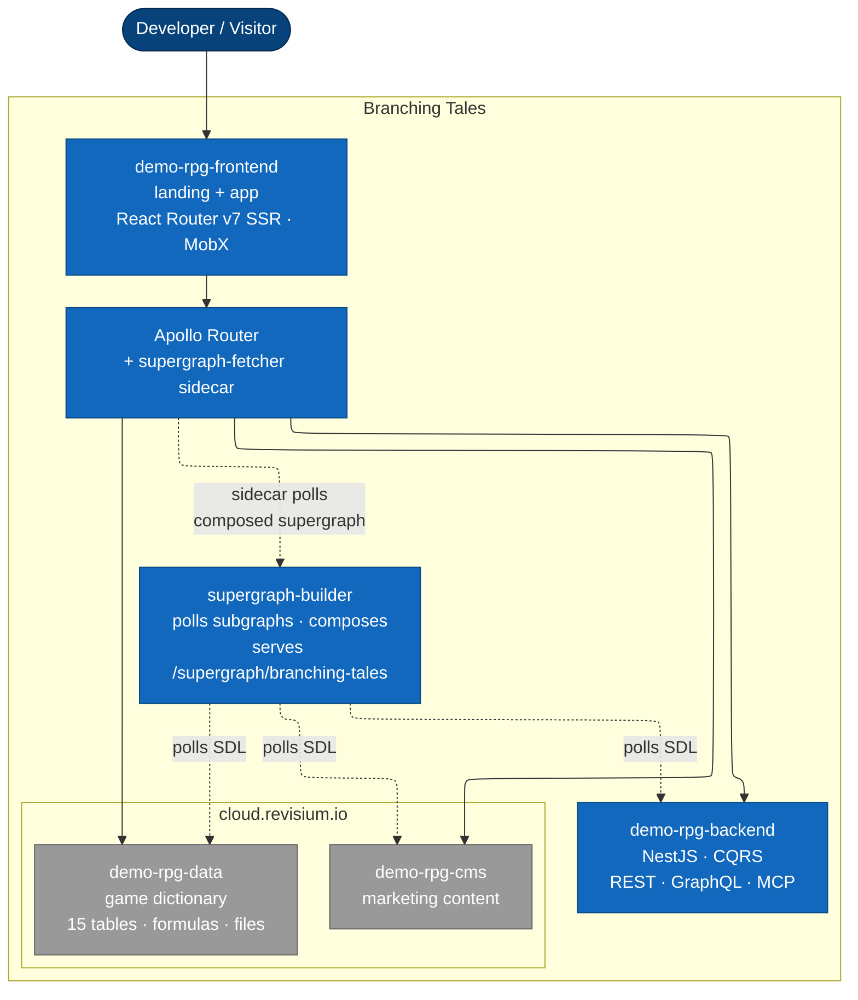

# demo-rpg — Project Passport

> Branching Tales — a fantasy adventurer's guild simulator built end-to-end on Revisium. Demonstrates JSON Schema modelling, foreign keys, file fields, computed formulas, schema evolution, branching, and a federated multi-API architecture.

| Parameter | Value |
|---|---|
| Codename | `demo-rpg` |
| Name | Branching Tales |
| Stage | Dev stand live — federated GraphQL + SSR frontend at [demo-rpg.dev.revisium.io](https://demo-rpg.dev.revisium.io) |
| Tech owner | <!-- TODO --> |
| Audience | DevRel — developers evaluating Revisium |
| Goal | Showcase **every** Revisium capability in a recognizable real-world use case |

## Overview

**Branching Tales** is a fantasy guild-management demo that uses Revisium as the system of record for game content (items, monsters, quests, parties) and for the marketing site that wraps it.

The demo is intentionally over-modelled to exercise every Revisium primitive: nested JSON Schema, single and array foreign keys, file fields with hash + content reference, computed fields with array aggregation and relative-path expressions, branching for balance patches, schema migrations via CLI, and three API surfaces (REST, GraphQL, MCP) federated under Apollo Router.

## Service URLs

| Service | Dev | Production | Notes |
|---|---|---|---|
| Landing + App | [demo-rpg.dev.revisium.io](https://demo-rpg.dev.revisium.io) | planned | React Router v7 SSR; `/graphql` co-located via ingress so the browser talks to the supergraph same-origin |
| API (Apollo Router) | [demo-rpg-router.dev.revisium.io/graphql](https://demo-rpg-router.dev.revisium.io/graphql) | planned | Federated GraphQL across backend + data + cms |
| Backend subgraph | [demo-rpg-backend.dev.revisium.io](https://demo-rpg-backend.dev.revisium.io) | planned | NestJS — REST (Swagger), GraphQL subgraph, MCP, OAuth |
| Game data (Revisium) | [cloud.revisium.io/revisium/demo-rpg-data](https://cloud.revisium.io/revisium/demo-rpg-data) | same | Dictionary project — 15 tables (regions, heroes, items, …); public-read |
| CMS (Revisium) | [cloud.revisium.io/revisium/demo-rpg-cms](https://cloud.revisium.io/revisium/demo-rpg-cms) | same | Marketing content — landing + blog tables; public-read |

## Architecture

- **Overview** — [architecture/overview.md](architecture/overview.md)
- **Decisions (ADR)** — [architecture/adr/README.md](architecture/adr/README.md)
- **Specs** — [architecture/specs/README.md](architecture/specs/README.md)
- **Runtime flows** — [architecture/runtime-flows/README.md](architecture/runtime-flows/README.md)

## Repositories

| Repository | Role | Stack |
|---|---|---|
| [demo-rpg-docs](https://github.com/revisium/demo-rpg-docs) | Project passport, ADR, specs, BR, skills, playbooks | Markdown |
| [demo-rpg-backend](https://github.com/revisium/demo-rpg-backend) | NestJS subgraph (CQRS, REST, GraphQL, MCP) — deployed to dev | NestJS 11, Prisma 7, `@hey-api/openapi-ts` client for Revisium |
| [demo-rpg-frontend](https://github.com/revisium/demo-rpg-frontend) | Companion app + landing — deployed to dev | React Router v7 SSR, MobX (MVVM), graphql-request + graphql-codegen, FSD (Steiger) |
| [revisium/infrastructure](https://github.com/revisium/infrastructure) | Helm charts + ArgoCD wiring for the dev stand | `development/demo/{backend,frontend,router,supergraph-builder}` |

Supergraph composition is handled by [`revisium/supergraph-builder`](https://github.com/revisium/supergraph-builder) — no separate demo repo. The image runs as a sidecar to Apollo Router in the dev cluster.

External dependencies: [revisium-cli](https://github.com/revisium/revisium-cli), [revisium/supergraph-builder](https://github.com/revisium/supergraph-builder), [Revisium Cloud](https://cloud.revisium.io), [Apollo Router](https://www.apollographql.com/docs/router).

## Architecture Overview

**In short:** the frontend (React Router v7 SSR + MobX MVVM + graphql-request) talks to Apollo Router. The router federates **three** subgraphs — a NestJS subgraph (`demo-rpg-backend`) plus the two Revisium-managed subgraphs (`demo-rpg-data`, `demo-rpg-cms`). `/graphql` is co-located under the frontend's ingress host so the browser only ever makes same-origin calls.

[`revisium/supergraph-builder`](https://github.com/revisium/supergraph-builder) is a **long-running service** that periodically polls each subgraph's GraphQL endpoint, composes the merged supergraph schema, and exposes it at an HTTP endpoint. Apollo Router runs a curl sidecar that polls that endpoint, writes the supergraph to a shared volume, and lets the router hot-reload — no CI step, no pushed deployment. Add a subgraph or change a schema and the supergraph reconciles within one polling interval.

Once both cloud projects are bootstrapped, everything in `cloud.revisium.io` is open for read-only exploration.

## Operations

- [Overview](operations/overview.md) — deployment, secrets, observability
- [Deploy](operations/deploy.md) — release procedures
- [Runbook](operations/runbook.md) — reactive procedures
- [Secrets](operations/secrets.md) — registry and rotation

## Business Requirements

- [requirements/README.md](requirements/README.md) — current BR catalogue.

## Bootstrap

- [bootstrap/](bootstrap/README.md) — applied schemas + seed data + apply script. Replicate the live demo in your own Revisium org with one command.

## Skills & Playbooks

- [skills/](skills/README.md) — Claude Code skills tailored to this demo (schema design, formula authoring, migration runs).
- [playbooks/](playbooks/README.md) — step-by-step guides for common tasks (bootstrap a fresh environment, add a new table, ship a balance patch).

## Research

- [research/](research/README.md) — discovery notes, comparisons, design alternatives.
