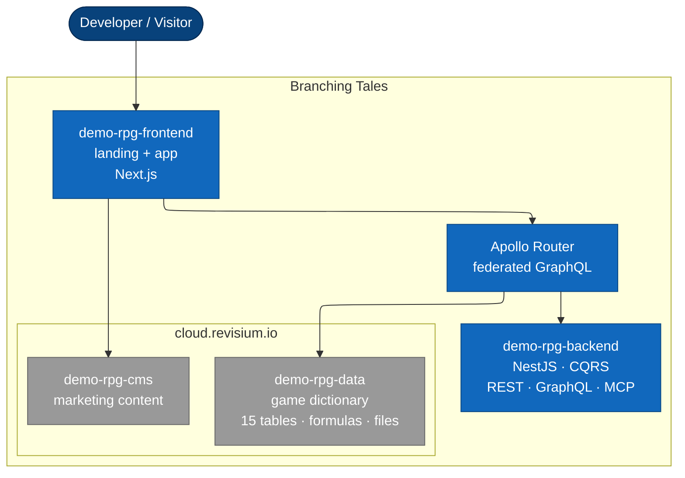

# demo-rpg — Project Passport

> Branching Tales — a fantasy adventurer's guild simulator built end-to-end on Revisium. Demonstrates JSON Schema modelling, foreign keys, file fields, computed formulas, schema evolution, branching, and a federated multi-API architecture.

| Parameter | Value |
|---|---|
| Codename | `demo-rpg` |
| Name | Branching Tales |
| Stage | Bootstrap (scaffolding) |
| Tech owner | <!-- TODO --> |
| Audience | DevRel — developers evaluating Revisium |
| Goal | Showcase **every** Revisium capability in a recognizable real-world use case |

## Overview

**Branching Tales** is a fantasy guild-management demo that uses Revisium as the system of record for game content (items, monsters, quests, parties) and for the marketing site that wraps it.

The demo is intentionally over-modelled to exercise every Revisium primitive: nested JSON Schema, single and array foreign keys, file fields with hash + content reference, computed fields with array aggregation and relative-path expressions, branching for balance patches, schema migrations via CLI, and three API surfaces (REST, GraphQL, MCP) federated under Apollo Router.

## Service URLs

| Service | Production | Notes |
|---|---|---|
| Landing | <!-- TODO --> | Public marketing site |
| App | <!-- TODO --> | Companion app (browse heroes, items, quests) |
| API (Apollo Router) | <!-- TODO --> | Federated GraphQL |
| Game data (Revisium) | `cloud.revisium.io/revisium/demo-rpg-data` *(planned — not yet bootstrapped)* | Dictionary project |
| CMS (Revisium) | `cloud.revisium.io/revisium/demo-rpg-cms` *(planned — not yet bootstrapped)* | Marketing content |

## Architecture

- **Overview** — [architecture/overview.md](architecture/overview.md)
- **Decisions (ADR)** — [architecture/adr/README.md](architecture/adr/README.md)
- **Specs** — [architecture/specs/README.md](architecture/specs/README.md)
- **Runtime flows** — [architecture/runtime-flows/README.md](architecture/runtime-flows/README.md)

## Repositories

| Repository | Role | Stack |
|---|---|---|
| [demo-rpg-docs](https://github.com/revisium/demo-rpg-docs) | Project passport, ADR, specs, BR, skills, playbooks | Markdown |
| demo-rpg-backend (planned) | NestJS subgraph (CQRS, REST, GraphQL, MCP) | NestJS, Prisma, fork of `template-nestjs-api` |
| demo-rpg-frontend (planned) | Companion app + landing | Next.js, Apollo Client |

External dependencies: [revisium-cli](https://github.com/revisium/revisium-cli), [Revisium Cloud](https://cloud.revisium.io), [Apollo Router](https://www.apollographql.com/docs/router).

## Architecture Overview

**In short:** the frontend talks to Apollo Router; the router federates a NestJS subgraph (`demo-rpg-backend`) with the Revisium-managed game-data subgraph (`demo-rpg-data`). The CMS project (`demo-rpg-cms`) feeds landing content directly. Once both cloud projects are bootstrapped, everything in `cloud.revisium.io` is open for read-only exploration.

## Operations

- [Overview](operations/overview.md) — deployment, secrets, observability
- [Deploy](operations/deploy.md) — release procedures
- [Runbook](operations/runbook.md) — reactive procedures
- [Secrets](operations/secrets.md) — registry and rotation

## Business Requirements

- [requirements/README.md](requirements/README.md) — current BR catalogue.

## Skills & Playbooks

- [skills/](skills/README.md) — Claude Code skills tailored to this demo (schema design, formula authoring, migration runs).
- [playbooks/](playbooks/README.md) — step-by-step guides for common tasks (bootstrap a fresh environment, add a new table, ship a balance patch).

## Research

- [research/](research/README.md) — discovery notes, comparisons, design alternatives.
