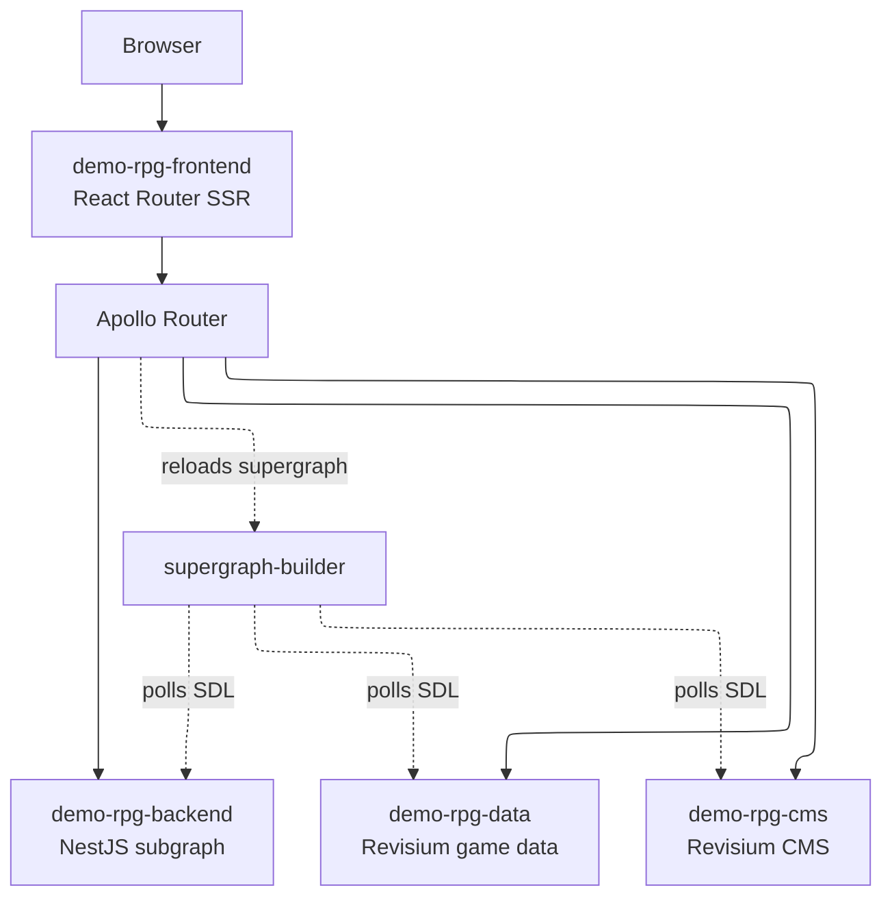

# Architecture

Branching Tales uses one frontend, one application backend, and two Revisium
Cloud projects.

## Runtime Path

1. The browser opens `demo-rpg.dev.revisium.io`.
2. The SSR frontend renders the codex UI.
3. Frontend data requests go to same-origin `/graphql`.
4. Apollo Router federates the request across:
   - `demo-rpg-backend`;
   - `demo-rpg-data`;
   - `demo-rpg-cms`.
5. The Explainer Widget shows the request, variables, sample response, and source
   links.

## Boundaries

- `demo-rpg-frontend`: routes, UI, page specs, ViewModels, SSR, and GraphQL
  operations.
- `demo-rpg-backend`: backend-owned fields, MCP/REST/GraphQL runtime, and the
  generated Revisium client.
- Revisium Cloud projects: game data, CMS data, schemas, files, formulas, and
  revisions.
- Apollo Router: federated graph at the public GraphQL edge.
- `supergraph-builder`: SDL polling and supergraph composition.
- `revisium/infrastructure`: deployment, ingress, secrets, Argo CD, Helm values.

For implementation details, go to the owning repo. This file is only the public
architecture summary.
