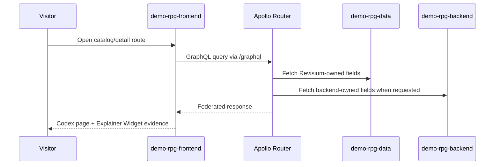
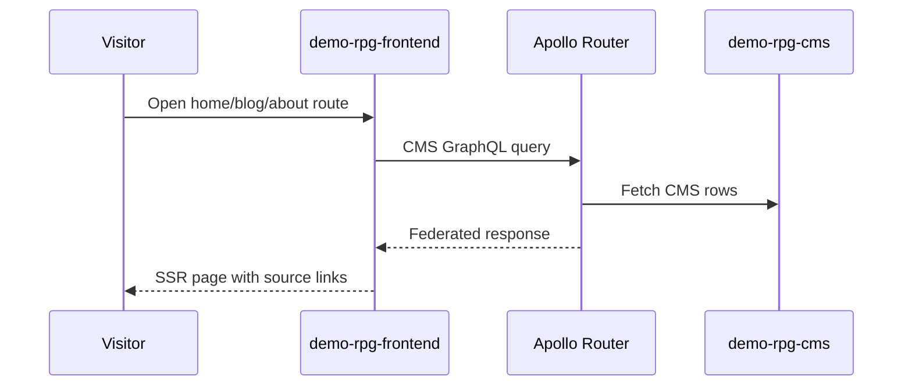

# Architecture Overview

**Navigation:** [project passport](../README.md) · [ADR](./adr/README.md) ·
[specs](./specs/README.md) · [runtime flows](./runtime-flows/README.md)

Branching Tales is a public RPG codex built as a federated demo. Revisium owns
the structured content and generated API surfaces; the application repos own
the runtime behaviour that is specific to the demo.

## Architecture Principles

1. Revisium first: game data and editorial content live in Revisium projects.
2. Federation, not aggregation: Apollo Router composes subgraphs into one API.
3. One project per concern: dictionary data and CMS content are separate.
4. Public read by default: visitors can inspect data without credentials.
5. Over-model deliberately: each route demonstrates a Revisium capability.
6. Implementation contracts stay with code: frontend/backend repos own exact
   route, runtime, and review rules.

## Components

| Component | Canonical repo/path | Role |
|---|---|---|
| `demo-rpg-frontend` | [`revisium/demo-rpg-frontend`](https://github.com/revisium/demo-rpg-frontend) | React Router v7 SSR frontend, MobX MVVM, `graphql-request`, page specs, frontend review rules |
| `demo-rpg-backend` | [`revisium/demo-rpg-backend`](https://github.com/revisium/demo-rpg-backend) | NestJS subgraph, CQRS business logic, REST, GraphQL, MCP, backend-owned runtime state |
| Apollo Router | `revisium/infrastructure` | Federated GraphQL gateway exposed to the frontend at `/graphql` |
| `supergraph-builder` | [`revisium/supergraph-builder`](https://github.com/revisium/supergraph-builder) | Polls SDL from all subgraphs, composes the supergraph, exposes it to the router sidecar |
| `demo-rpg-data` | [`cloud.revisium.io/revisium/demo-rpg-data`](https://cloud.revisium.io/revisium/demo-rpg-data) | Revisium dictionary project: 15 game-data tables, formulas, files, branching |
| `demo-rpg-cms` | [`cloud.revisium.io/revisium/demo-rpg-cms`](https://cloud.revisium.io/revisium/demo-rpg-cms) | Revisium CMS project: landing content, blog posts, authors, marketing content |
| `revisium-cli` | [`revisium/revisium-cli`](https://github.com/revisium/revisium-cli) | Applies migrations, bootstraps endpoints, regenerates OpenAPI/client artifacts |

See [README § Architecture Overview](../README.md#architecture-overview) for the
component diagram.

## Runtime Flows

### Visitor Reads Game Data

### Visitor Reads CMS Content

### Schema Reconciliation

Detailed flow: [runtime-flows/schema-reconciliation.md](./runtime-flows/schema-reconciliation.md).

## Cross-Cutting Concerns

| Concern | Approach |
|---|---|
| Auth | Public reads for demo content; mutations and backend-owned runtime state require backend auth where applicable. |
| Caching | Frontend uses same-origin `/graphql`; backend uses its own cache layer; CDN/router caching is documented in operations/infrastructure when enabled. |
| Observability | Backend exposes health/metrics/logs; router and supergraph-builder health belong to infrastructure runbooks. |
| Versioning | Schema intent in `architecture/specs/`; applied migrations/OpenAPI/client in `demo-rpg-backend`; portable seed snapshot in `bootstrap/`. |
| Reviewability | Frontend and backend repos own implementation review contracts; this repo owns product and architecture intent. |
