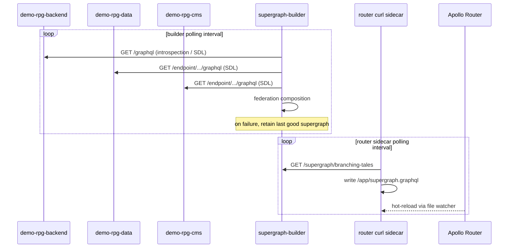

# Runtime Flow — Schema Reconciliation

> Status: Current public flow. Concrete intervals and private service names live
> in `revisium/infrastructure`.

**Navigation:** [project passport](../../README.md) · [overview](../overview.md) · [ADR-0001](../adr/ADR-0001-federation-with-revisium-cloud.md) · [runtime flows index](./README.md)

How a schema change in any subgraph reaches a running Apollo Router without CI, image rebuilds, or restarts.

## Actors

| Actor | Role |
|---|---|
| `demo-rpg-backend` | NestJS subgraph (Yoga federation v2). Source of truth for its SDL. |
| `demo-rpg-data` | Revisium-managed subgraph. SDL exposed at `cloud.revisium.io/.../graphql`. |
| `demo-rpg-cms` | Revisium-managed subgraph. SDL exposed at `cloud.revisium.io/.../graphql`. |
| `supergraph-builder` | Long-running service. Polls each subgraph at `POLL_INTERVAL_S`, runs federation composition, serves the result at an HTTP endpoint. |
| Apollo Router | Federated gateway. Runs a curl sidecar that polls `supergraph-builder` at its own interval, writes the schema to a shared volume, and hot-reloads. |

## Sequence

## Failure modes

| Failure | Behaviour |
|---|---|
| One subgraph endpoint unreachable | `supergraph-builder` retries on next tick; previous good supergraph remains served. |
| Composition error (FK / `@key` mismatch) | `supergraph-builder` reports failure on its health endpoint; previous good supergraph remains served; router keeps current schema. |
| `supergraph-builder` itself unreachable | Router curl sidecar fails to refetch; router keeps the schema already in the shared volume. |
| Shared volume write fails | Sidecar retries on next tick. Router keeps current schema. |

## Tunables

| Knob | Where | Effect |
|---|---|---|
| Builder polling interval | `supergraph-builder` env | How quickly subgraph changes are detected. |
| Router sidecar polling interval | router curl sidecar | How quickly composed-supergraph changes reach the router. |
| `SUBGRAPH_*` env vars | `supergraph-builder` | The subgraph endpoint registry. Adding a subgraph = adding an env var + restart. |

## Why this beats CI composition

- No build step in the path: a schema change is picked up by polling, not by waiting for CI to run.
- The router never sees an invalid supergraph — composition validates before the new schema is exposed to the sidecar.
- One operational pattern handles every subgraph regardless of provenance (NestJS, Revisium, or anything else with a federated GraphQL endpoint).

## Open questions

| # | Question | Status |
|---|---|---|
| 1 | Whether to expose `supergraph-builder` health endpoint publicly for the demo | Open |
| 2 | How to surface composition errors in the demo UI for visitors | Open |
