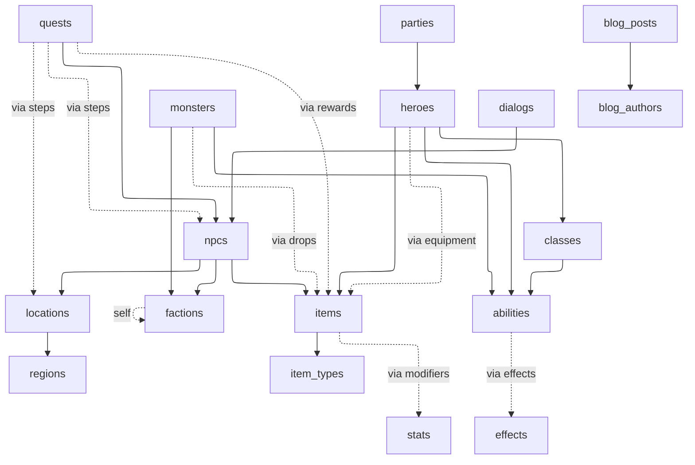

# Schemas — Branching Tales

> Status: Spec for v1. Field-level catalogue and conventions live here. Full JSON Schema bodies (one file per table) live in `demo-rpg-backend/revisium/schemas/*.json` once that repo is bootstrapped, and are kept in sync with this document.

**Navigation:** [project passport](../../README.md) · [overview](../overview.md) · [game design](./game-design.md) · [formulas](./formulas.md) · [files](./files.md)

## How to read this spec

- The **Conventions** section defines reusable building blocks (localized strings, file refs, FK syntax, embedded arrays, enums, computed fields). Each appears verbatim throughout, so they are written once.
- Each table has a **field table** describing every property in plain prose.
- A few representative tables are shown with **full JSON Schema** to illustrate the conventions in context.
- The companion CMS project (`demo-rpg-cms`) is documented separately at the end.

### Related ADRs

This spec is the **what**; the **why** lives in the ADRs:

- [ADR-0001 — Federation with Revisium Cloud as a subgraph](../adr/ADR-0001-federation-with-revisium-cloud.md) — explains why both Revisium projects (`demo-rpg-data`, `demo-rpg-cms`) are exposed as federated subgraphs through Apollo Router rather than consumed directly. Drives the SDL/`@key` expectations on every table here.
- [ADR-0002 — Two cloud projects: dictionary vs CMS](../adr/ADR-0002-dictionary-vs-cms-split.md) — explains the split into `demo-rpg-data` (15 dictionary tables, see below) and `demo-rpg-cms` (5 marketing tables, end of this document) and why both stay federated despite different editorial cadences.

## Conventions

### Localized string — `<LocalizedString>`

Every user-facing string is an inline object. `en` is the canonical fallback; `ru` (Russian) and `zh` (Chinese, defaults to Simplified) are declared with empty-string defaults and are present in seed rows because the current runtime does not support omitted optional object fields.

```json
{
  "type": "object",
  "required": ["en"],
  "properties": {
    "en": { "type": "string", "default": "" },
    "ru": { "type": "string", "default": "" },
    "zh": { "type": "string", "default": "" }
  },
  "additionalProperties": false
}
```

Throughout the rest of this document the placeholder **`<LocalizedString>`** stands for that exact object body. Internal identifiers, enum codes, and FK strings remain plain `string`.

### File reference — `<FileRef>`

A file field uses the Revisium-built-in file schema:

```json
{ "$ref": "urn:jsonschema:io:revisium:file-schema:1.0.0" }
```

Persisted file value carries `status`, `fileId`, `url`, `fileName`, `hash`, `extension`, `mimeType`, `size`, `width`, `height` — see [`files.md`](./files.md).

### Foreign key — single

```json
{
  "type": "string",
  "default": "",
  "foreignKey": "<target_table>"
}
```

Field naming: `<target>_id`. Example: `class_id` references `classes`, `region_id` references `regions`.

### Foreign key — array

```json
{
  "type": "array",
  "items": {
    "type": "string",
    "default": "",
    "foreignKey": "<target_table>"
  }
}
```

Field naming: `<target>_ids`. Example: `ally_ids` references `factions`, `hero_ids` references `heroes`. Self-referencing FK arrays are allowed (a `factions` row's `ally_ids` references other `factions`).

### Embedded array of objects

```json
{
  "type": "array",
  "items": {
    "type": "object",
    "required": [...],
    "properties": { ... },
    "additionalProperties": false
  }
}
```

Field naming: plural noun, no `_id` suffix. Example: `steps`, `effects`, `modifiers`, `drops`. The objects can themselves contain FK fields, embedded arrays (one more level), and computed fields.

### Enum

```json
{
  "type": "string",
  "default": "<default_value>",
  "enum": ["value_one", "value_two", "value_three"]
}
```

Used for `abilities.school`, `classes.primary_stat`, `parties.formation`, `items.rarity`, etc. Enum values are `lowercase_snake_case`.

### Computed field — `x-formula`

Computed fields are declared with the `x-formula` extension keyword. The expression is evaluated by `@revisium/formula` against **the same row's data** (formulas cannot dereference foreign keys to read other rows; see [`formulas.md`](./formulas.md) for the engine's data-scope rules).

```json
{
  "type": "<inferred_return_type>",
  "x-formula": {
    "version": 1,
    "expression": "<formula_string>"
  }
}
```

`type` is the formula's return type (`number`, `string`, `boolean`). The field has no stored value — it is recomputed on every read. See [`formulas.md`](./formulas.md) for the catalogue of expressions.

## Tables — `demo-rpg-data`

15 tables. The numerical column is the canonical ordering used by the seed data.

### 1. `regions`

Top-level world geography. Self-contained — no FKs out.

| Field | Type | Notes |
|---|---|---|
| `name` | `<LocalizedString>` | Display name |
| `description` | `<LocalizedString>` | World-building blurb |
| `cover_image` | `<FileRef>` | Required region cover art, uploaded in Admin UI and used by catalog/detail pages |
| `climate` | enum: `temperate`, `alpine`, `coastal`, `desert`, `forest` | Drives flavour, no mechanical effect |

Required: `name`, `description`, `cover_image`, `climate`.

### 2. `locations`

Towns, dungeons, ruins. Each belongs to a region.

| Field | Type | Notes |
|---|---|---|
| `region_id` | FK → `regions` | |
| `name` | `<LocalizedString>` | |
| `description` | `<LocalizedString>` | |
| `map` | `<FileRef>` | Required primary map illustration |
| `gallery` | `<FileRef>[]` | Required gallery field. Seed rows contain one placeholder image; Admin UI can add more uploaded images. |
| `kind` | enum: `town`, `village`, `dungeon`, `ruin`, `wilderness` | |
| `coordinates` | object `{ x: number, y: number }` | Map-relative coordinates |

Required: `region_id`, `name`, `description`, `map`, `gallery`, `kind`, `coordinates`.

### 3. `factions`

Allegiances. Demonstrates self-referencing FK arrays.

| Field | Type | Notes |
|---|---|---|
| `name` | `<LocalizedString>` | |
| `description` | `<LocalizedString>` | |
| `crest` | `<FileRef>` | Faction emblem |
| `alignment` | enum: `lawful_good`, `lawful_neutral`, `neutral`, `chaotic_neutral`, `chaotic_evil` | |
| `ally_ids` | FK array → `factions` | Self-reference |
| `enemy_ids` | FK array → `factions` | Self-reference |
| `ally_count` | `number`, **`x-formula`** `count(ally_ids)` | Counter on FK array |
| `enemy_count` | `number`, **`x-formula`** `count(enemy_ids)` | Counter on FK array |

Required: `name`, `description`, `crest`, `alignment`.

### 4. `item_types`

Small lookup of item categories (FK target).

| Field | Type | Notes |
|---|---|---|
| `name` | `<LocalizedString>` | "Weapon", "Armor", "Potion", "Scroll" |
| `description` | `<LocalizedString>` | |
| `code` | `string` | Stable machine code: `weapon`, `armor`, `potion`, `scroll` |

Required: `name`, `description`, `code`.

### 5. `items`

Equipment, consumables, and unique artefacts.

| Field | Type | Notes |
|---|---|---|
| `type_id` | FK → `item_types` | |
| `name` | `<LocalizedString>` | |
| `description` | `<LocalizedString>` | |
| `icon` | `<FileRef>` | |
| `rarity` | enum: `common`, `uncommon`, `rare`, `epic`, `legendary` | |
| `rarity_multiplier` | `number` | 1.0 / 1.5 / 2.5 / 5.0 / 10.0 by tier |
| `base_value` | `number` | Gold |
| `weight` | `number` | |
| `modifiers` | embedded array `{ stat_id (FK → stats), value (number) }` | Item stat modifiers |
| `market_value` | `number`, **`x-formula`** `base_value * rarity_multiplier` | Scalar arithmetic |
| `rarity_tag` | `string`, **`x-formula`** `if(rarity == "legendary", "epic-tier", if(rarity == "epic", "high-tier", "common-tier"))` | Nested conditional |

Required: `type_id`, `name`, `description`, `icon`, `rarity`, `rarity_multiplier`, `base_value`, `weight`, `modifiers`, `market_value`, `rarity_tag`.

### 6. `abilities`

Spells, skills, and combat techniques.

| Field | Type | Notes |
|---|---|---|
| `name` | `<LocalizedString>` | |
| `description` | `<LocalizedString>` | |
| `icon` | `<FileRef>` | |
| `school` | enum: `abjuration`, `conjuration`, `divination`, `enchantment`, `evocation`, `illusion`, `necromancy`, `transmutation` | 8-school enum constraint |
| `kind` | enum: `active`, `passive`, `reaction` | |
| `base_damage` | `number` | |
| `damage_scaling` | `number` | Per-level scalar |
| `cooldown` | `number` | Turns |
| `level_required` | `number` | |
| `effects` | embedded array `{ effect_id (FK → effects), chance (number), duration (number) }` | What the ability inflicts |

Required: `name`, `description`, `icon`, `school`, `kind`, `base_damage`, `damage_scaling`, `cooldown`, `level_required`, `effects`.

### 7. `classes`

Hero archetypes.

| Field | Type | Notes |
|---|---|---|
| `name` | `<LocalizedString>` | |
| `description` | `<LocalizedString>` | |
| `icon` | `<FileRef>` | Required class glyph used by the class catalog and hero filters |
| `primary_stat` | enum: `strength`, `dexterity`, `intelligence`, `wisdom`, `constitution`, `charisma` | |
| `base_hp` | `number` | |
| `hp_per_level` | `number` | |
| `mp_per_level` | `number` | |
| `starting_ability_ids` | FK array → `abilities` | Granted at level 1 |

Required: `name`, `description`, `icon`, `primary_stat`, `base_hp`, `hp_per_level`, `mp_per_level`, `starting_ability_ids`.

### 8. `npcs`

Quest givers, merchants, trainers, lore-keepers.

| Field | Type | Notes |
|---|---|---|
| `faction_id` | FK → `factions` | |
| `location_id` | FK → `locations` | |
| `name` | `<LocalizedString>` | |
| `title` | `<LocalizedString>` | "Captain", "Master", "Elder" |
| `description` | `<LocalizedString>` | |
| `portrait` | `<FileRef>` | |
| `role` | enum: `quest_giver`, `merchant`, `trainer`, `lore_keeper` | |
| `inventory_item_ids` | FK array → `items` | Merchant stock; empty for non-merchants |
| `display_label_en` | `string`, **`x-formula`** `concat(title.en, " ", name.en)` | String concat across same-row locale fields |

Required: `faction_id`, `location_id`, `name`, `title`, `description`, `portrait`, `role`, `inventory_item_ids`, `display_label_en`.

### 9. `monsters`

Enemies. Demonstrates FK array (abilities) and embedded array (drops) side by side.

| Field | Type | Notes |
|---|---|---|
| `faction_id` | FK → `factions` | |
| `name` | `<LocalizedString>` | |
| `description` | `<LocalizedString>` | |
| `image` | `<FileRef>` | |
| `kind` | enum: `beast`, `humanoid`, `undead`, `aberration`, `construct` | |
| `level` | `number` | |
| `hp` | `number` | |
| `base_damage` | `number` | |
| `ability_ids` | FK array → `abilities` | What it can do in combat |
| `drops` | embedded array `{ item_id (FK → items), chance (number 0..1), quantity_min (number), quantity_max (number) }` | Drop table |
| `avg_drop_chance` | `number`, **`x-formula`** `avg(drops[*].chance)` | Embedded array AVG |
| `max_drop_quantity` | `number`, **`x-formula`** `max(drops[*].quantity_max)` | Embedded array MAX over field |
| `drop_count` | `number`, **`x-formula`** `count(drops)` | Embedded array length |

Required: `faction_id`, `name`, `description`, `image`, `kind`, `level`, `hp`, `base_damage`, `ability_ids`, `drops`, `avg_drop_chance`, `drop_count`.

### 10. `heroes`

The roster. The richest table — exercises both FK arrays and embedded arrays.

| Field | Type | Notes |
|---|---|---|
| `class_id` | FK → `classes` | |
| `name` | `<LocalizedString>` | |
| `epithet` | `<LocalizedString>` | "the Bold", "of the Vale" |
| `level` | `number` | 1..20 |
| `constitution` | `number` | Stat |
| `gold` | `number` | |
| `portrait` | `<FileRef>` | |
| `ability_ids` | FK array → `abilities` | Known abilities |
| `inventory_item_ids` | FK array → `items` | Backpack |
| `equipment` | embedded array `{ slot (enum: head, chest, legs, hands, feet, main_hand, off_hand, ranged), item_id (FK → items), modifier (number) }` | Slotted gear |
| `is_veteran` | `boolean`, **`x-formula`** `level >= 10` | Boolean derived |
| `total_equipment_modifier` | `number`, **`x-formula`** `sum(equipment[*].modifier)` | Embedded array SUM |
| `equipped_count` | `number`, **`x-formula`** `count(equipment)` | Embedded array length |
| `display_name_en` | `string`, **`x-formula`** `concat(name.en, " ", epithet.en)` | String concat |

Required: `class_id`, `name`, `epithet`, `level`, `constitution`, `gold`, `portrait`, `ability_ids`, `inventory_item_ids`, `equipment`, `is_veteran`, `total_equipment_modifier`, `equipped_count`, `display_name_en`.

### 11. `parties`

Adventuring groups. Demonstrates FK array + count formula.

| Field | Type | Notes |
|---|---|---|
| `name` | `<LocalizedString>` | |
| `motto` | `<LocalizedString>` | Required motto |
| `formation` | enum: `vanguard`, `balanced`, `defensive`, `skirmisher` | |
| `hero_ids` | FK array → `heroes` | |
| `member_count` | `number`, **`x-formula`** `count(hero_ids)` | Counter on FK array |
| `is_full` | `boolean`, **`x-formula`** `count(hero_ids) >= 4` | Counter + comparison |

Required: `name`, `motto`, `formation`, `hero_ids`, `member_count`, `is_full`.

### 12. `quests`

Adventures. Uses nested embedded arrays (`steps[*].rewards[*]`) for the two-level aggregation demo.

| Field | Type | Notes |
|---|---|---|
| `giver_npc_id` | FK → `npcs` | |
| `name` | `<LocalizedString>` | |
| `description` | `<LocalizedString>` | |
| `map` | `<FileRef>` | |
| `kind` | enum: `tutorial`, `side`, `story`, `endgame` | |
| `level_required` | `number` | |
| `is_repeatable` | `boolean` | |
| `steps` | embedded array `{ step_number (number), description (<LocalizedString>), image (<FileRef>), location_id (FK → locations), npc_id (FK → npcs), xp (number), rewards (embedded array { item_id (FK → items), quantity (number), bonus_xp (number) }) }` | Nested embedded with required image per step |
| `total_xp` | `number`, **`x-formula`** `sum(steps[*].xp)` | Embedded array SUM (one level) |
| `total_loot_xp` | `number`, **`x-formula`** `sum(steps[*].rewards[*].bonus_xp)` | Nested embedded array SUM (two levels) |
| `step_count` | `number`, **`x-formula`** `count(steps)` | |

Required: `giver_npc_id`, `name`, `description`, `map`, `kind`, `level_required`, `is_repeatable`, `steps`, `total_xp`, `total_loot_xp`, `step_count`.

### 13. `dialogs`

NPC dialogue trees. Pure embedded-array showcase of deeply nested JSON.

| Field | Type | Notes |
|---|---|---|
| `npc_id` | FK → `npcs` | |
| `slug` | `string` | e.g. `greeting`, `quest_offer`, `farewell` |
| `lines` | embedded array `{ speaker (enum: npc, hero), text (<LocalizedString>), emotion (enum: neutral, happy, angry, sad, surprised) }` | The dialog content |
| `line_count` | `number`, **`x-formula`** `count(lines)` | |

Required: `npc_id`, `slug`, `lines`, `line_count`.

### 14. `stats`

Primary stats lookup (FK target for `items.modifiers[*].stat_id`).

| Field | Type | Notes |
|---|---|---|
| `code` | `string` | Stable machine code: `strength`, `dexterity`, etc. |
| `name` | `<LocalizedString>` | |
| `abbreviation` | `string` | "STR", "DEX", "INT", "WIS", "CON", "CHA" |
| `description` | `<LocalizedString>` | |

Required: `code`, `name`, `abbreviation`, `description`.

### 15. `effects`

Status effects (FK target for `abilities.effects[*].effect_id`).

| Field | Type | Notes |
|---|---|---|
| `code` | `string` | `poison`, `stunned`, `blessed`, `bleeding`, etc. |
| `name` | `<LocalizedString>` | |
| `description` | `<LocalizedString>` | |
| `kind` | enum: `buff`, `debuff`, `damage_over_time`, `crowd_control` | |
| `default_duration` | `number` | Turns |

Required: `code`, `name`, `description`, `kind`, `default_duration`.

## Reference JSON — three full tables

The conventions above are dense. Three tables in full JSON make the pattern concrete. The remaining 12 dictionary tables follow the same patterns; full JSON for all 15 lives in `demo-rpg-backend/revisium/schemas/*.json` once bootstrapped.

### `regions.json`

```json
{
  "type": "object",
  "required": ["name", "description", "cover_image", "climate"],
  "properties": {
    "name": {
      "type": "object",
      "required": ["en"],
      "properties": {
        "en": { "type": "string", "default": "" },
        "ru": { "type": "string", "default": "" },
        "zh": { "type": "string", "default": "" }
      },
      "additionalProperties": false
    },
    "description": {
      "type": "object",
      "required": ["en"],
      "properties": {
        "en": { "type": "string", "default": "" },
        "ru": { "type": "string", "default": "" },
        "zh": { "type": "string", "default": "" }
      },
      "additionalProperties": false
    },
    "cover_image": {
      "$ref": "urn:jsonschema:io:revisium:file-schema:1.0.0"
    },
    "climate": {
      "type": "string",
      "default": "temperate",
      "enum": ["temperate", "alpine", "coastal", "desert", "forest"]
    }
  },
  "additionalProperties": false
}
```

### `factions.json`

```json
{
  "type": "object",
  "required": ["name", "description", "crest", "alignment"],
  "properties": {
    "name": { /* <LocalizedString> */ },
    "description": { /* <LocalizedString> */ },
    "crest": { "$ref": "urn:jsonschema:io:revisium:file-schema:1.0.0" },
    "alignment": {
      "type": "string",
      "default": "neutral",
      "enum": ["lawful_good", "lawful_neutral", "neutral", "chaotic_neutral", "chaotic_evil"]
    },
    "ally_ids": {
      "type": "array",
      "items": { "type": "string", "default": "", "foreignKey": "factions" }
    },
    "enemy_ids": {
      "type": "array",
      "items": { "type": "string", "default": "", "foreignKey": "factions" }
    },
    "ally_count": {
      "type": "number",
      "x-formula": { "version": 1, "expression": "count(ally_ids)" }
    },
    "enemy_count": {
      "type": "number",
      "x-formula": { "version": 1, "expression": "count(enemy_ids)" }
    }
  },
  "additionalProperties": false
}
```

### `quests.json` (excerpt — shows nested embedded + multi-level formula)

```json
{
  "type": "object",
  "required": ["giver_npc_id", "name", "description", "map", "kind", "level_required", "is_repeatable", "steps", "total_xp", "total_loot_xp", "step_count"],
  "properties": {
    "giver_npc_id": { "type": "string", "default": "", "foreignKey": "npcs" },
    "name": { /* <LocalizedString> */ },
    "description": { /* <LocalizedString> */ },
    "map": { "$ref": "urn:jsonschema:io:revisium:file-schema:1.0.0" },
    "kind": {
      "type": "string",
      "default": "side",
      "enum": ["tutorial", "side", "story", "endgame"]
    },
    "level_required": { "type": "number", "default": 1 },
    "is_repeatable": { "type": "boolean", "default": false },
    "steps": {
      "type": "array",
      "items": {
        "type": "object",
        "required": ["step_number", "description", "image", "location_id", "npc_id", "xp", "rewards"],
        "properties": {
          "step_number": { "type": "number", "default": 0 },
          "description": { /* <LocalizedString> */ },
          "image": { "$ref": "urn:jsonschema:io:revisium:file-schema:1.0.0" },
          "location_id": { "type": "string", "default": "", "foreignKey": "locations" },
          "npc_id": { "type": "string", "default": "", "foreignKey": "npcs" },
          "xp": { "type": "number", "default": 0 },
          "rewards": {
            "type": "array",
            "items": {
              "type": "object",
              "required": ["item_id", "quantity", "bonus_xp"],
              "properties": {
                "item_id": { "type": "string", "default": "", "foreignKey": "items" },
                "quantity": { "type": "number", "default": 0 },
                "bonus_xp": { "type": "number", "default": 0 }
              },
              "additionalProperties": false
            }
          }
        },
        "additionalProperties": false
      }
    },
    "total_xp": {
      "type": "number",
      "x-formula": { "version": 1, "expression": "sum(steps[*].xp)" }
    },
    "total_loot_xp": {
      "type": "number",
      "x-formula": { "version": 1, "expression": "sum(steps[*].rewards[*].bonus_xp)" }
    },
    "step_count": {
      "type": "number",
      "x-formula": { "version": 1, "expression": "count(steps)" }
    }
  },
  "additionalProperties": false
}
```

## Tables — `demo-rpg-cms`

5 tables. Lighter than the dictionary; intended to demonstrate Revisium-as-CMS for a real landing site.

### 1. `landing_hero`

Hero section copy. Single-row table.

| Field | Type |
|---|---|
| `headline` | `<LocalizedString>` |
| `subheadline` | `<LocalizedString>` |
| `cta_label` | `<LocalizedString>` |
| `cta_url` | `string` |
| `bg_image` | `<FileRef>` |

### 2. `landing_features`

Feature grid. Multi-row, ordered.

| Field | Type |
|---|---|
| `order` | `number` |
| `title` | `<LocalizedString>` |
| `body` | `<LocalizedString>` |
| `icon` | `<FileRef>` |

### 3. `landing_testimonials`

| Field | Type |
|---|---|
| `quote` | `<LocalizedString>` |
| `author_name` | `string` |
| `author_role` | `<LocalizedString>` |
| `avatar` | `<FileRef>` |

### 4. `blog_posts`

| Field | Type |
|---|---|
| `slug` | `string` |
| `author_id` | FK → `blog_authors` |
| `title` | `<LocalizedString>` |
| `excerpt` | `<LocalizedString>` |
| `body` | `<LocalizedString>` (markdown content per locale) |
| `hero_image` | `<FileRef>` |
| `published_at` | `string` (ISO 8601) |

> Note: a `blog_tags` table and a `blog_posts.tag_ids` FK array are **not part of the v1 contract**. Tracked under [Open question 2](#open-questions) as a follow-up migration.

### 5. `blog_authors`

| Field | Type |
|---|---|
| `slug` | `string` |
| `name` | `<LocalizedString>` |
| `bio` | `<LocalizedString>` |
| `avatar` | `<FileRef>` |

## Foreign-key graph

Convention: an arrow goes from the **table that holds the FK field** to the **referenced table**.



Solid arrows are direct FK fields (single or array). Dashed arrows are FKs inside embedded arrays. The self-loop on `factions` represents `ally_ids[]` and `enemy_ids[]`.

## Migration plan

Schema migrations on `master`:

| Migration | What it does | Demonstrates |
|---|---|---|
| `0001-initial-tables.json` | Create all 15 dictionary tables (CMS in a separate project's first migration). | Bulk schema bootstrap. |
| `0002-add-monster-drop-quantity-range.json` | Add `quantity_min` and `quantity_max` to `monsters.drops[*]` (replacing a single `quantity`). | Schema evolution within an embedded array. |
| `0003-add-item-rarity-tag-formula.json` | Add the `rarity_tag` computed field to `items`. | Adding an `x-formula` field to an existing table. |
| `0004-add-third-locale-zh.json` | Add `zh` field to every `<LocalizedString>` instance. | Wide schema evolution; locale rollout. |

### Balance branches (data only — no schema migrations)

| Branch | What it changes | Demonstrates |
|---|---|---|
| `balance-patch-1.1` | Tunes `abilities.base_damage` and `items.rarity_multiplier` values for selected rows. No schema changes — only seed data. | Revisium branching for live-ops: balance tweaks without disturbing `master`. |

Branch operations are not migration files. They are draft revisions on a separate branch, committed against the same `master` schema.

## Open questions

| # | Question | Status |
|---|---|---|
| 1 | Whether to split `zh` into `zh_cn` (Simplified) and `zh_tw` (Traditional) as a future migration | Open |
| 2 | Whether to add a `blog_tags` table and a `blog_posts.tag_ids` FK array as a follow-up migration (currently excluded from the v1 contract) | Open |
| 3 | Whether `quests.steps[*].rewards[*]` should also support `ability_id` rewards (currently item-only) | Open |
| 4 | Whether to add `weight_total` formula on heroes (sum of inventory weights) — would need item embedded into hero, breaking the FK pattern | Open |
| 5 | Whether `items.modifiers[*]` should also expose a `total_modifier_value` formula | Open |
| 6 | Whether to add a `news` table to demonstrate multi-key `orderBy` (`pinned desc, published_at desc`), time-window `where` (`published_at <= now`), and enum categories (`patch / event / spotlight / release`). The page-inventory currently assumes `data.news`; this question also decides whether news lives in `demo-rpg-data` (next to game content) or `demo-rpg-cms` (next to `blog_posts`). See [BR-0003 Q8](../../requirements/BR-0003-frontend-showcase.md#9-open-questions) and [messaging.md §3.5](../../products/branching-tales/messaging.md#35-pinned-news--launch-post). Draft field set: `title <LocalizedString>`, `excerpt <LocalizedString>`, `body <LocalizedString>`, `category enum`, `cover_image <FileRef>`, `published_at DateTime`, `pinned bool`, `author_id → blog_authors` (FK reuse). | Open |
