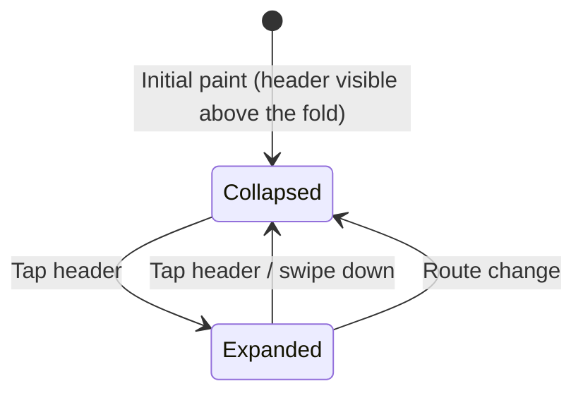

# Explainer Widget

Component spec for the cross-cutting "How this uses Revisium" widget that appears on every catalog and detail page of the Branching Tales frontend ([`demo-rpg-frontend`](https://github.com/revisium/demo-rpg-frontend)).

**Status:** v1 spec. Not yet implemented — first consumer will be `pages/regions/` (see [page inventory](./page-inventory.md)).
**Owner:** @anton-revisium
**Last updated:** 2026-05-12

**Navigation:** [products README](./README.md) · [BR-0003](../../requirements/BR-0003-frontend-showcase.md) · [feature coverage matrix](./revisium-feature-coverage.md) · [page inventory](./page-inventory.md)

## Purpose

Surface, on every page, the exact request the page is making (GraphQL / REST / MCP), a representative JSON sample, the per-field subgraph attribution, and a deep link into `cloud.revisium.io` — so a developer evaluating Revisium can read the source of every field they see without leaving the page or guessing at the schema.

Realises [BR-0003 §5 US-1 / US-2 / US-7 / US-8](../../requirements/BR-0003-frontend-showcase.md#5-user-scenarios) and the `Explainer reveals` column of every row in the [feature coverage matrix](./revisium-feature-coverage.md).

## Where it appears

| Page family | Renders widget? | Notes |
|---|---|---|
| Catalog pages (`/regions`, `/heroes`, `/items`, …) | Yes — required | Anchored to the catalog grid; reflects the active filter / sort / locale. |
| Detail pages (`/regions/[id]`, `/heroes/[id]`, …) | Yes — required | Renders the single-entity query; on federated detail pages also surfaces the per-subgraph field attribution. |
| Search page (`/search`) | Yes — required | Shows the `searchRows` call. |
| Branching preview page (`/balance-patch`) | Yes — required | Shows both revision URIs (`master:head` and `master:draft`) and the diff call. |
| Blog (`/blog`, `/blog/[slug]`) | Yes — required | Shows the CMS subgraph queries. |
| Home (`/`) | Optional | CMS-driven landing. If a section pulls live data (`landing_features`, `landing_testimonials`), a widget is rendered next to it; static brand copy is not annotated. |
| Auth / 404 / 500 / error pages | No | No Revisium request to explain. |

## Anatomy (functional blocks)

| Block | Shows | Visible when | UX note |
|---|---|---|---|
| Header chip | One-line label: "How this uses Revisium". A small **subgraph badge cluster** lists every subgraph contributing fields to the page (e.g. `data` · `cms` · `backend`) | Always after data loads | Tap/click to expand the accordion on phone. |
| Summary line | One sentence answering "what Revisium feature is on this page?" sourced from the page's [feature coverage row](./revisium-feature-coverage.md) | Always after data loads | Plain prose, no jargon — must read well to a non-GraphQL reader. |
| Surface tabs | `GraphQL` · `REST` · `MCP` | Always after data loads | `REST` and `MCP` are visible only when the page has equivalents — see [§API surfaces](#api-surfaces). |
| Request panel | The verbatim request body for the active surface — GraphQL query string, REST URL + method, or MCP tool name + arguments | Always | Syntax-highlighted; copy button. |
| Variables panel | JSON of variables / query params / MCP arguments derived from the page's current state (active filter, sort, page cursor, locale) | When the page has variables | Updates live as the user edits filters or switches locale (see [§Interplay](#interplay-with-other-affordances)). |
| Response sample | JSON sample of the response — truncated to the visible rows with an "Show more" expander | After the first successful response | Real response from the last fetch, NOT a static example. |
| Subgraph attribution | Per-rendered-field chip mapping `field → owning subgraph` (e.g. `name → data`, `likes → backend`); aggregated badge cluster also lives in the header | When the page renders federated fields | Most useful on federated detail pages; on Revisium-only catalogs the cluster reduces to a single chip. |
| Deep-link bar | "View in cloud.revisium.io" → table or row in the source-of-truth project; "View schema" → JSON Schema panel; "View OpenAPI" → matching REST endpoint; "View MCP tool" → tool entry in `demo-rpg-docs` | Always after data loads | Per-link rules in [§Deep links](#deep-links). All open in a new tab. |
| Federation explainer (collapsible) | When federated: the `extend type X @key(fields: "id") { … }` SDL excerpt from the backend, plus a link to the backend source | Federated pages only | Hidden behind a "How does this work?" disclosure to keep the widget compact. |
| Footer note | One-line meta — "Anonymous, public-read; equivalent `curl` works in your terminal" with a copy-curl button | Always | Reinforces BR-0003's read-only / public-read scope. |

## Per-breakpoint layout

| Breakpoint | Layout | Widget state on initial paint |
|---|---|---|
| Phone (≤ 480 px) | Single-column page. Widget is a **collapsed accordion** whose **header stays above the fold** (chip + summary line visible without scrolling); body expands on tap | Collapsed |
| Tablet (481–1024 px) | Two-column split: catalog grid on the left, Widget docked to the right column. Above-the-fold on initial paint | Expanded, default surface tab = `GraphQL` |
| Desktop (≥ 1024 px) | Side-docked Widget on the right, sticky in the viewport while the user scrolls the catalog. Width ≤ 420 px; never obscures catalog content | Expanded, default surface tab = `GraphQL` |

Mermaid sketch — accordion behaviour on phone:



Hard rules:

- Header (chip + summary line) is always above the fold on every breakpoint.
- No horizontal scroll outside the request panel and the response sample (those scroll inside their own scroll regions).
- Touch targets ≥ 44 × 44 px on tap (header, tabs, copy buttons, deep-link buttons).
- Sticky side-dock on desktop must yield to a scrolled-to-top state on route change.

## Data contract

The widget is rendered with a single `ExplainerDescriptor` argument the page ViewModel constructs from the page's GraphQL/REST/MCP request and the page's current state.

```ts
interface ExplainerDescriptor {
  summary: string;                    // one-sentence answer to "what Revisium feature is on this page?"
  surfaces: {
    graphql: GraphQLSurface;          // always present
    rest?: RestSurface;               // optional — present only when the page has a REST equivalent
    mcp?: McpSurface;                 // optional — present only when the page has an MCP equivalent
  };
  variables: Record<string, unknown>; // JSON-serialisable; reflects the page's current state (filter/sort/locale)
  responseSample: unknown | null;     // JSON-serialisable; the most recent successful response, or null pre-fetch
  subgraphsInUse: ReadonlyArray<'data' | 'cms' | 'backend'>;
  fieldAttribution?: ReadonlyArray<{   // optional — present only on federated pages
    path: string;                     //   e.g. "regionses.edges[*].node.likes"
    owningSubgraph: 'data' | 'cms' | 'backend';
  }>;
  deepLinks: {
    cloudRow?: string;                // cloud.revisium.io row URL for detail pages
    cloudTable: string;               // cloud.revisium.io table URL for catalog pages
    cloudSchema: string;              // cloud.revisium.io schema URL for the relevant table
    openApi?: string;                 // demo-rpg-backend Swagger anchor for the REST equivalent
    mcpTool?: string;                 // demo-rpg-docs anchor for the MCP tool spec
    federationSdlSource?: string;     // demo-rpg-backend source URL for the `extend type X` SDL
  };
  federation?: {                       // present only when federation is being demonstrated
    sdlExcerpt: string;               //   raw `extend type RegionsNode @key(fields: "id") { … }`
    summary: string;                  //   one-sentence "what's federated here"
  };
}

interface GraphQLSurface {
  operationName: string;
  query: string;                       // verbatim query body
}
interface RestSurface {
  method: 'GET' | 'POST';
  urlTemplate: string;                 // e.g. "GET /api/regions?filter={…}&sort={…}"
}
interface McpSurface {
  toolName: string;                    // e.g. "list_regions"
  argumentsHint: Record<string, unknown>;
}
```

The page ViewModel owns construction; the widget is presentational. No business logic, no fetching, no service container access from inside the widget — purely a function of its descriptor + the current breakpoint.

## API surfaces

The Widget exposes three tabs. Each maps to one surface in the Branching Tales federated stack:

| Surface | Source | Visible when | Notes |
|---|---|---|---|
| `GraphQL` | The actual operation issued by the page against `/graphql` (same-origin under the SSR ingress) | Always — every page is GraphQL-first | The default surface tab. Variables panel shows the active filter / sort / page cursor / locale. |
| `REST` | The matching `demo-rpg-backend` REST endpoint | When the page's domain has a REST equivalent in Swagger | Surface tab links to the corresponding Swagger operation. |
| `MCP` | The matching MCP tool exposed by `demo-rpg-backend` | When the page's domain has an MCP tool registered | Surface tab links to the tool spec under `demo-rpg-docs/architecture/specs/`. |

When `REST` or `MCP` are absent for a page, the corresponding tab is omitted (not disabled). Catalog and detail pages always have all three; the search and branching-preview pages omit the surface tabs they lack.

## Subgraph attribution

The widget tells two related stories about ownership:

1. **In-page chips** — beside every rendered field on the page card (`name`, `description`, `likes`, …) a small chip indicates the **owning subgraph** (`data` / `cms` / `backend`). Driven by `fieldAttribution[]` on the descriptor. Most useful on federated detail pages. On Revisium-only catalogs every chip is `data` and the chips collapse to a single header chip cluster instead.
2. **Header cluster** — the widget header always lists the *set* of subgraphs contributing to the page, regardless of how many fields each contributes. Useful for the "ah, this page actually crosses subgraphs" moment.

Both views are visually consistent — same chip styling, same colour mapping per subgraph (a `data` / `cms` / `backend` palette defined in the design-system tokens once they land).

## Deep links

| Link | When shown | Destination rule |
|---|---|---|
| `View in cloud.revisium.io` (table) | Catalog pages | `https://cloud.revisium.io/revisium/{project}/master/tables/{tableId}` |
| `View in cloud.revisium.io` (row) | Detail pages | `https://cloud.revisium.io/revisium/{project}/master/tables/{tableId}/rows/{rowId}` |
| `View schema` | Always | `https://cloud.revisium.io/revisium/{project}/master/tables/{tableId}/schema` |
| `View OpenAPI` | When the REST tab is visible | demo-rpg-backend Swagger UI anchor for the matching operation |
| `View MCP tool` | When the MCP tab is visible | Anchor under `demo-rpg-docs/architecture/specs/` for the MCP tool catalogue (path TBD when the catalogue lands) |
| `View federation source` | Federated pages only | demo-rpg-backend source URL anchored at the `extend type X` block |

All links open in a new tab with `rel="noopener"`. URLs are deterministic from the page's `project` / `tableId` / `rowId` — the widget itself never hand-crafts a URL.

## Interplay with other affordances

| Affordance | Effect on the widget |
|---|---|
| Filter / sort panel | The variables panel updates **live** (before the request fires) as the user edits the form, so cause and effect are visible. After the request resolves, the response sample refreshes. |
| Pagination ("Load more") | Variables panel shows the new `after` cursor; response sample either replaces or extends the previous sample (TBD — open question). |
| Locale toggle | The GraphQL query body in the request panel updates to show the language-specific sub-field selection (`name { en }` → `name { ru }`). Response sample re-fetches. |
| Branching toggle (on `/balance-patch`) | Variables / URI panel shows the revision URI (`master:head` vs `master:draft`); the widget renders a diff strip on top. |
| Federated field rendering | Field-attribution chips light up next to each rendered field; header cluster reflects the multi-subgraph composition. |
| Error / empty states | The widget reflects the page state (see [§States](#states)). |

## States

| State | Trigger | Widget behaviour |
|---|---|---|
| Initial paint, no data yet | Page first SSR / hydration | Header chip and summary line visible (above the fold); panels show skeleton placeholders. |
| Loaded — default | Page request succeeds, no active filter / sort | All panels populated; default surface tab is `GraphQL`. |
| Loaded — with active filter / sort / locale | User has edited the form / switched locale | Variables panel reflects the new state; if the new request is in flight, panels show a "Refreshing…" hint without blanking the previous content. |
| Loaded — federated | Page renders fields from > 1 subgraph | Field-attribution chips visible on the page; federation explainer disclosure available in the widget body. |
| Page request failed | Upstream router / subgraph error | Widget shows the same request that failed + the error response sample; the failing subgraph is highlighted in the header cluster; surface tabs remain switchable. |
| Empty result set | Query succeeded with zero rows | Variables + request panels are still populated; response sample renders `{ "data": { "regionses": { "edges": [], "totalCount": 0 } } }`; widget summary line falls back to "no rows match the active filter" wording. |
| Phone, accordion collapsed | Initial paint on small viewport | Only the header chip + summary line are rendered; tap to expand. |
| Phone, accordion expanded | After tap | Full widget body inline; tap header again to collapse. |
| Route change | `react-router` navigation | Widget unmounts and re-mounts against the new page's descriptor; no carry-over of expanded/collapsed state. |

## Transitions

| From | Trigger | Condition | To | Feedback |
|---|---|---|---|---|
| Collapsed (phone) | Tap header | Always | Expanded | Slide-down + caret rotates |
| Expanded (phone) | Tap header / swipe down | Always | Collapsed | Slide-up + caret rotates |
| `GraphQL` tab | Tap `REST` / `MCP` tab | Surface tab exists | The chosen surface | Tab indicator slides; panels swap content |
| Default loaded | Filter edit | Form valid | Variables panel updates synchronously, request fires after debounce | Request panel value unchanged; variables panel highlights the changed key |
| Default loaded | Locale toggle | Different locale | Request panel + variables update synchronously; request re-fires | Sub-field selection in query body diffs visibly |
| Loaded | Route change | Always | Initial paint on the new page's widget | Unmount old widget |

## Accessibility

- Semantic landmarks: the widget renders as `<section aria-labelledby="explainer-heading">`. The header is `<h2 id="explainer-heading">`.
- Surface tabs implement the ARIA tabs pattern (`role="tablist"` / `role="tab"` / `role="tabpanel"`); arrow keys cycle, `Home` / `End` jump.
- Accordion on phone uses `<button aria-expanded="…" aria-controls="explainer-body">`.
- All code panels are focusable scroll containers (`tabindex="0"`) so keyboard users can scroll long queries / response samples.
- Copy buttons announce success via an `aria-live="polite"` region; failures via `aria-live="assertive"`.
- Per-field subgraph chips have `aria-label="field {path} comes from the {subgraph} subgraph"`.
- Colour is never the only signal — every subgraph chip carries a short text label as well.
- `prefers-reduced-motion: reduce` collapses every slide / rotate transition to an instant cut.

## Implementation notes

- Layer: `src/widgets/explainer-widget/` in `demo-rpg-frontend` (FSD `widgets` layer; the widget is allowed to be reused across pages but never imported from `shared`).
- Public surface: a single React component `ExplainerWidget` that takes an `ExplainerDescriptor` prop. No DI access, no fetchers, no MobX store inside the widget — the descriptor is the entire input.
- Each page ViewModel exposes a `get explainer(): ExplainerDescriptor` getter that derives the descriptor from the page's current MobX-observable state. Locale, filter, sort, and pagination changes therefore propagate automatically.
- Pre-bundled syntax highlighting via a small Shiki / Prism layer; lazy-load the highlighter on first widget render to keep the initial bundle under the BR-0003 250 KB gzip budget.
- The widget never owns the SSR fetch path — descriptors are constructed by the page; on SSR `responseSample` is set to the actual loader response so it ships in initial HTML (per BR-0003 US-8 / US-2).
- Steiger: the widget is allowed to import from `src/shared/lib`, `src/shared/config`, `src/shared/ui`. Not allowed: `pages/*`, `entities/*`, `features/*`. Per-page ViewModels live in `pages/*` and construct the descriptor.

## Open questions

| # | Question | Owner | Due | Status |
|---|---|---|---|---|
| 1 | Should the response sample track the *full* response or be capped (e.g. first 3 edges)? Capping keeps the panel readable but hides "what's actually in the payload" — affects US-2. | @anton-revisium | TBD | Open |
| 2 | "Load more" — do we append the new edges to the sample (lets the user see the cursor effect) or replace (keeps the panel small)? Likely append-with-divider. | @anton-revisium | TBD | Open |
| 3 | Copy-curl button: do we ship the bearer auth header placeholder (`-H 'Authorization: Bearer <token>'`) commented-out for visitors who'll later need auth, or omit it entirely since the public dev stand has none? | @anton-revisium | TBD | Open |
| 4 | On error states — do we show the raw subgraph error JSON (helpful but noisy) or a cleaned-up message + a "raw" disclosure? | @anton-revisium | TBD | Open |
| 5 | Federation explainer disclosure: do we cache the SDL excerpt at build time (in the codegen step) or fetch from `_service { sdl }` at render time? Build-time keeps the bundle smaller; runtime guarantees freshness. | @anton-revisium | TBD | Open |

## Related artefacts

- **BR**: [BR-0003 — Frontend Showcase](../../requirements/BR-0003-frontend-showcase.md) (§5 US-1/2/7/8, §6 functional row, §8 NFRs).
- **Feature matrix**: [revisium-feature-coverage.md](./revisium-feature-coverage.md) (`Explainer reveals` column anchored to this spec).
- **Page inventory**: [page-inventory.md](./page-inventory.md) — every page rendering the widget.
- **Reference page**: `pages/regions/` (planned) — first concrete consumer.

## Changelog

### v1 (2026-05-12)

- Initial spec. Anatomy (10 functional blocks), three-breakpoint layout, full `ExplainerDescriptor` data contract, surface tabs (GraphQL / REST / MCP), subgraph attribution (in-page chips + header cluster), deep-link rules, interplay with locale / branching / filter / pagination, states, transitions, a11y, FSD implementation notes, 5 open questions.
